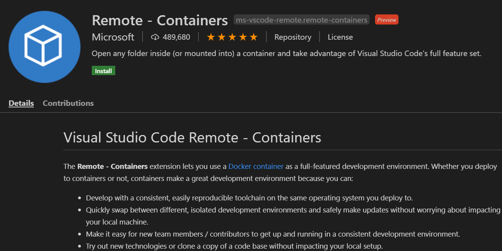
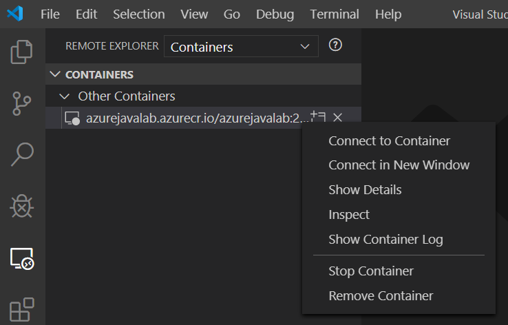
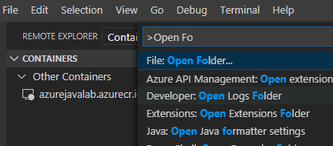
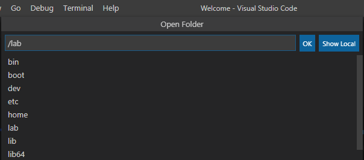
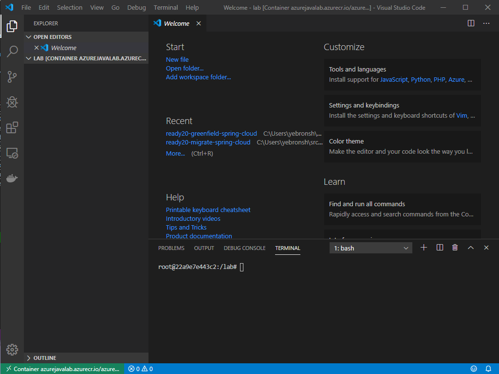

# 00 - Setup your environment

__This guide is part of the [Azure Spring Cloud training](../README.md)__

Setting up all the necessary prerequisites in order to expeditiously complete the lab.

---

## Creating Azure Resources

To save time, we provide an ARM template for creating all the Azure resources you will need for this lab other than the Azure Spring Cloud instance itself. Use the Deploy to Azure button below.

> 💡 Use the following settings for deploying the Azure Template:
> * Create a new resource group
> * Set West US2 as the location
> * Save the MySQL password you specify in this step. You will need it in section 6.

[](https://portal.azure.com/#create/Microsoft.Template/uri/https%3A%2F%2Fraw.githubusercontent.com%2Fmicrosoft%2Fazure-spring-cloud-training%2Fmaster%2F00-setup-your-environment%2Fazuredeploy.json?WT.mc_id=azurespringcloud-github-judubois)

>💡 The resource provisioning will take some time. Continue with the workshop.

## Setting up your local environment

 The easiest way to get all the pre-requisites is to use the provided docker image (see ["Using Docker"](#using-docker) below). Alternatively, you can install all the pre-requisites on your own machine (see ["Local System Prerequisites"](#local-system-prerequisites) below).

> 💡 All commands in this lab are formatted for the Bash shell. While Azure CLI should behave identically on all environments, some semantics may need to be modified if you use other shells.

> 💡 In sections 9 and 10, you will access the UI of the Microservice application in a web browser. This UI does not render correctly in Internet Explorer and the pre-Chromium version of Edge. Use the [new Edge](https://microsoft.com/edge/?WT.mc_id=azurespringcloud-github-judubois), Google Chrome, or Firefox for these sections.

### Using Docker (Recommended)

A docker image containing all of the pre-requisites is available. You'll need:

* Docker Desktop.
  > If you need to install Docker...
  > - [Click here](https://download.docker.com/win/stable/Docker%20Desktop%20Installer.exe) for Windows
  > - [Click here](https://download.docker.com/mac/stable/Docker.dmg) for Mac

* Visual Studio Code ([Download here](https://code.visualstudio.com/?WT.mc_id=azurespringcloud-github-judubois))
* ["Remote - Containers" extension](https://marketplace.visualstudio.com/items?itemName=ms-vscode-remote.remote-containers&WT.mc_id=azurespringcloud-github-judubois) for Visual Studio Code

With Docker installed, run (in bash or PowerShell with administrator privileges)

```bash
docker run -d azurejavalab.azurecr.io/azurejavalab:latest
```

#### Preparing Visual Studio Code

Visual Studio code makes it easy to edit files and run commands inside a container all in one single, fluid interface. If you don't have VS Code installed, [install it now](https://code.visualstudio.com).

With Visual Studio Code installed, open the page for the [Remote - Containers](https://marketplace.visualstudio.com/items?itemName=ms-vscode-remote.remote-containers&WT.mc_id=azurespringcloud-github-judubois) extension and click "Install". If prompted to allow the browser to open Visual Studio Code, allow it.

Visual Studio Code will open, showing the description of the Remote Containers extension. Click on the green install button on that page to install the extension:



If an "uninstall" button appears in place of the "Install" button, then the extension is already installed and you can continue.

#### Connecting to the Container

With the container running on your machine, click on the "Remote Explorer" button on the left toolbar in Visual Studio Code:


The Remote Explorer pane will appear, and you should see the lab container in it. Right-click on the container and click "Connect to Container".



A new window will open. Press CTRL+SHIFT+P (Mac: ⇧⌘P) to open the command bar and Enter "Open Folder". Select the "File: Open Folder" command. In the subsequent dialog, enter `/lab`:





Click Ok.

You should now see the contents of the `lab` folder on the left side pane. There isn't much to see (yet), as the folder is empty.

Last, press CTRL+SHIFT+\` (Mac: ⌃⇧`) or choose "Terminal: Create New Integrated Terminal" from the command pallete.

Your Visual Studio Code window should now look like this:



You can use the integrated shell on the bottom right for any command you need to run as part of this lab. Any files you need to edit, you can open from the panel on the left or by pressing CTRL+P.

### Local System Prerequisites (Only if you can't use Docker)

This training lab requires the following to be installed on your machine:

* [JDK 1.8](https://www.azul.com/downloads/azure-only/zulu/?&version=java-8-lts&architecture=x86-64-bit&package=jdk)
* A text editor or an IDE. If you do not already have an IDE for Java development, we recommend using [Visual Studio Code](https://code.visualstudio.com/?WT.mc_id=azurespringcloud-github-judubois) with the [Java Extension Pack](https://marketplace.visualstudio.com/items?itemName=vscjava.vscode-java-pack&WT.mc_id=azurespringcloud-github-judubois).
* [Azure CLI](https://docs.microsoft.com/en-us/cli/azure/install-azure-cli?view=azure-cli-latest&WT.mc_id=azurespringcloud-github-judubois) version 2.0.80 or later. You can check the version of your current Azure CLI installation by running:

  ```bash
  az --version
  ```

* 🚧 The `spring-cloud` extension for Azure CLI. You can install this extension after installing Azure CLI by running `az extension add -n spring-cloud -y`.
* [MySQL CLI](https://dev.mysql.com/downloads/)

The environment variable `JAVA_HOME` should be set to the path of `javac` in the JDK installation.

You can then use Visual Studio Code or an IDE of your choice.

---

➡️ Next guide: [01 - Create an Azure Spring Cloud instance](../01-create-an-azure-spring-cloud-instance/README.md)
