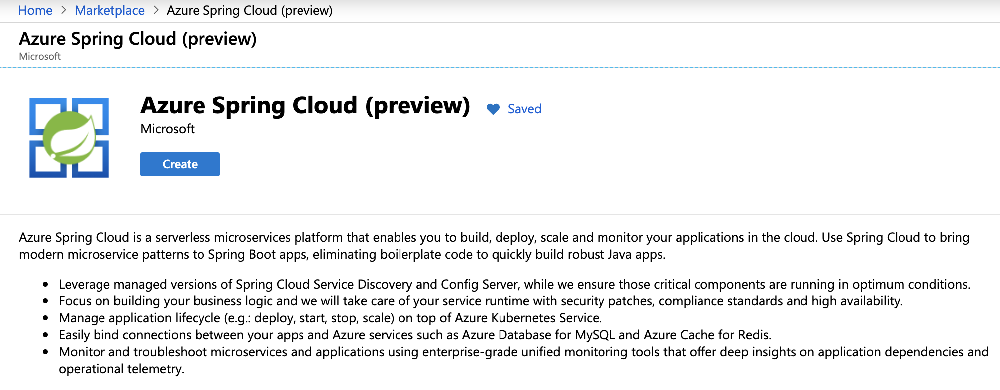
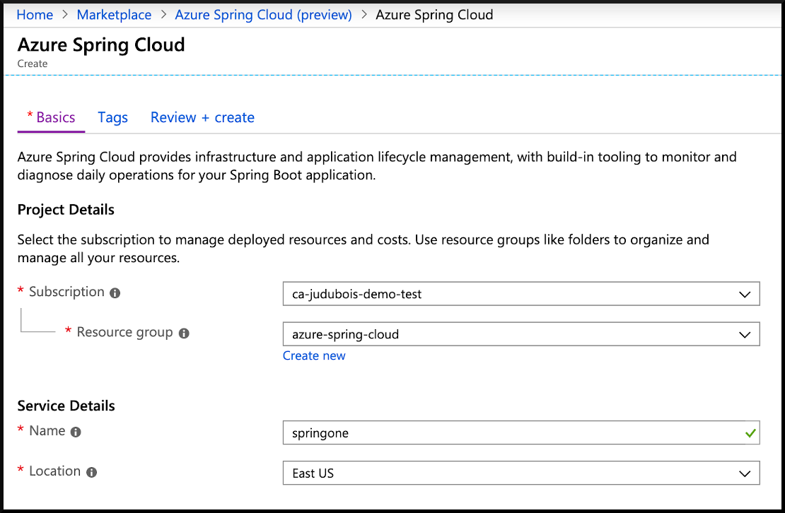

# 01 - Create a cluster

__This guide is part of the [Azure Spring Cloud training](../README.md)__

Basics on creating a cluster and configuring the CLI to work efficiently.

## Install the CLI and authenticate

Install the [Azure CLI](https://docs.microsoft.com/en-us/cli/azure/install-azure-cli/?WT.mc_id=azurespringcloud-github-judubois) and log in to your account:

```
az login
```

## Install the Azure Spring Cloud CLI extension

__This is temporary, and will not be necessary when the service is released__

```
az extension add -y --source https://github.com/VSChina/azure-cli-extensions/releases/download/0.4/spring_cloud-0.4.0-py2.py3-none-any.whl
```

## Create an Azure Spring Cloud instance

__This is temporary, and will not be necessary when the service is released__

[Click here](https://portal.azure.com/?microsoft_azure_marketplace_ItemHideKey=AppPlatformExtension#blade/Microsoft_Azure_Marketplace/MarketplaceOffersBlade/selectedMenuItemId/home/searchQuery/spring) to access the cluster creation page.



- Click on "Create"
- Select your subscription, resource group name, name of the service and location
- Once everything is validated, the cluster can be created

