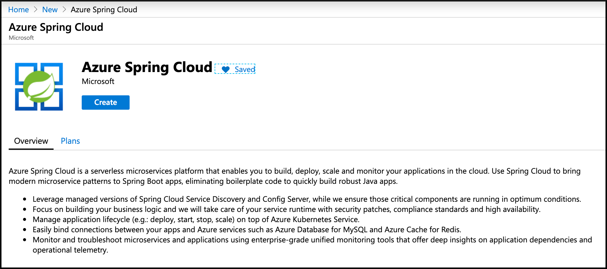
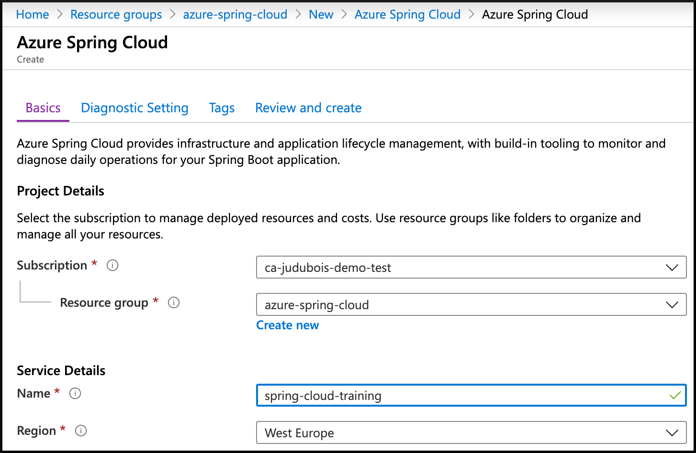
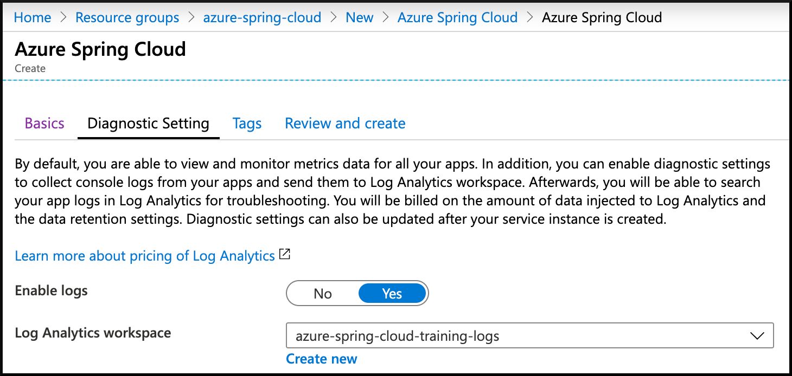
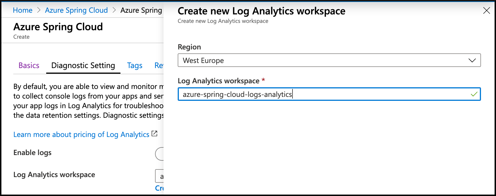

# 01 - Create a cluster

__This guide is part of the [Azure Spring Cloud training](../README.md)__

Basics on creating a cluster and configuring the CLI to work efficiently.

---

## Install the CLI and authenticate

Install the [Azure CLI](https://docs.microsoft.com/en-us/cli/azure/install-azure-cli/?WT.mc_id=azurespringcloud-github-judubois) and log in to your account:

```bash
az login
```

Configure the CLI to use Azure subscription you want to use for this training:

```bash
# List all subscriptions
az account list -o table

# Set active subscription
az account set --subscription <target subscription ID>
```

## Install the Azure Spring Cloud CLI extension

__This is temporary, and will not be necessary when the service is released__

```bash
az extension add --name spring-cloud
```

## Create an Azure Spring Cloud instance

- [Click here](https://portal.azure.com/?WT.mc_id=azurespringcloud-github-judubois&microsoft_azure_marketplace_ItemHideKey=AppPlatformExtension#blade/Microsoft_Azure_Marketplace/MarketplaceOffersBlade/selectedMenuItemId/home/searchQuery/spring%20cloud) to access the cluster creation page.



- Click on "Azure Spring Cloud" and then on "Create".
- Select your subscription, resource group name, name of the service and location.



- Click on "Next : Diagnostic Setting" to go to the next screen.
- Here you can either select an existing "Log Analytics workspace" or create a new one. Create a new one, and we will configure it in [03 - Configure application logs](../03-configure-application-logs/README.md).





- Once everything is validated, the cluster can be created.

Creating the cluster will take a few minutes.

## Configure the CLI to use that cluster

Using the cluster's resource group and name by default will save you a lot of typing later:

```bash
az configure --defaults group=<resource group name>
az configure --defaults spring-cloud=<service instance name>
```

---

➡️ Next guide: [02 - Build a simple Spring Boot microservice](../02-build-a-simple-spring-boot-microservice/README.md)
