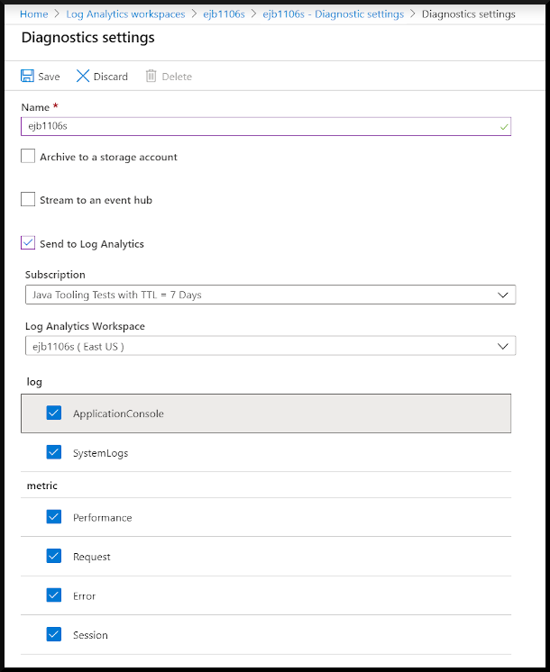

# 03 - Configure application logs

__This guide is part of the [Azure Spring Cloud training](../README.md)__

Access Spring Boot applications logs to understand common issues.

---

## About log aggregation

There are actually three ways to access your application's logs: [Azure Storage](https://docs.microsoft.com/en-us/azure/storage/common/storage-introduction/?WT.mc_id=azurespringcloud-github-judubois), [Azure Events Hub](https://docs.microsoft.com/en-us/azure/event-hubs/?WT.mc_id=azurespringcloud-github-judubois), and [Log Analytics](https://docs.microsoft.com/en-us/azure/azure-monitor/log-query/get-started-portal/?WT.mc_id=azurespringcloud-github-judubois). We will focus here on Log Analytics as it's the default solution configured with Azure Spring Cloud.

## Configure Log Analytics

[Log Analytics](https://docs.microsoft.com/en-us/azure/azure-monitor/log-query/get-started-portal/?WT.mc_id=azurespringcloud-github-judubois) is part of [Azure Monitor](https://azure.microsoft.com/en-us/services/monitor/), which is well-integrated into Azure Spring Cloud, and which we will also use for metrics monitoring.

In [01 - Create a cluster](../01-create-a-cluster/README.md), when the Azure Spring Cloud cluster was created, you should have also created a new "Log Analytics workspace" and linked it to your Azure Spring Cloud cluster.

<details>
  <summary>If you did not configure it during the cluster creation, here's how to set up the "Log Analytics workspace" manually</summary>

- Go to the [the Azure portal](https://portal.azure.com/).
- Search for "Log Analytics workspaces" in the search box.
- Create a new workspace in your Azure Spring Cloud resource group.


- Now that the Log analytics workspace has been created, we must configure our Azure Spring Cloud cluster instance to send its data to this workspace.
- Go to the "Overview" page of your Azure Spring Cloud cluster, and select "Diagnostic settings" in the "Monitoring" section of the navigation pane.
- Click on "Add diagnostic setting" and configure your cluster to send all its logs to the Log analytics workspace that we just created.
- Fill in the values as shown here and click "Save".



</details>

## Query application logs

Logs are now available in the "Logs" link in the "Monitoring" section in the navigation pane for your Azure Spring Cloud cluster.  Click on "Logs" and, optionally, go through any tutorial content provided.  Feel free to skip that content for now.

This is a shortcut to the Logs Analytics workspace that was created earlier, so you can access that workspace through both menus.

This workspace allows to do queries on the aggregated logs, the most common one being to get the latest log from a specific application:

__Important:__ Spring Boot applications logs have a dedicated `AppPlatformLogsforSpring` type.

As we called the application in the [previous guide](../02-build-a-simple-spring-boot-microservice/README.md) "simple-microservice", here is how to get its 50 most recent logs of the `AppPlatformLogsforSpring` type for this application.  Insert this text in the text area that states "Type your queries here or click on of the example queries to start".  Click the text of the query, then click "Run".

```
AppPlatformLogsforSpring
| where AppName == "simple-microservice"
| limit 50
```


---

⬅️ Previous guide: [02 - Build a simple Spring Boot microservice](../02-build-a-simple-spring-boot-microservice/README.md)

➡️ Next guide: [04 - Configure a Spring Cloud Config server](../04-configure-a-spring-cloud-config-server/README.md)
