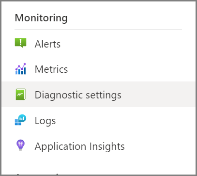
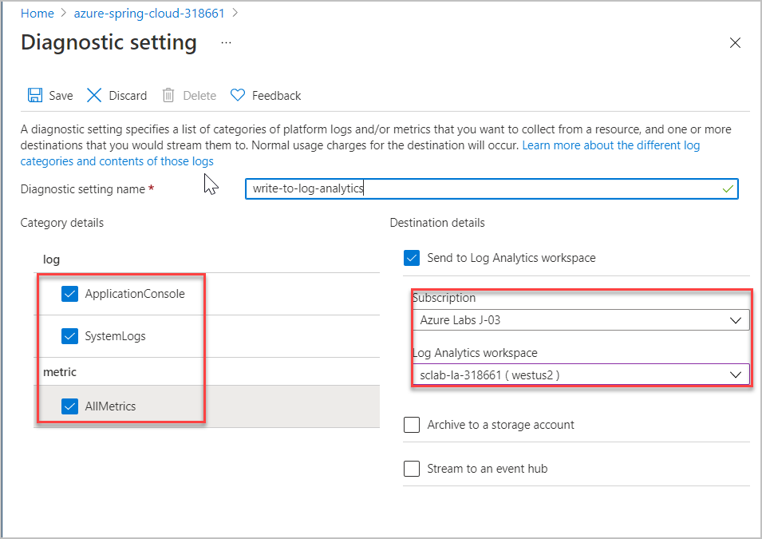

# Exercise 3 - Configure application logs

Now that we have an application deployed, we'll configure Log Analytics, so that we can quickly search the application's logs if something goes wrong. We'll see how to take advantage of Log Analytics in a later section, but because it takes time for log entries to start coming in, we'll do the configuration steps here before moving on with the training.

---

## Task 1 : Configure log aggregation

1. There are actually three ways to access your application's logs: [Azure Storage](https://docs.microsoft.com/en-us/azure/storage/common/storage-introduction/?WT.mc_id=azurespringcloud-github-judubois), [Azure Events Hub](https://docs.microsoft.com/en-us/azure/event-hubs/?WT.mc_id=azurespringcloud-github-judubois), and [Log Analytics](https://docs.microsoft.com/en-us/azure/azure-monitor/log-query/get-started-portal/?WT.mc_id=azurespringcloud-github-judubois). We will focus here on Log Analytics as it's the most common one, and as it's integrated into Azure Spring Cloud.

2. [Log Analytics](https://docs.microsoft.com/en-us/azure/azure-monitor/log-query/get-started-portal/?WT.mc_id=azurespringcloud-github-judubois) is part of [Azure Monitor](https://azure.microsoft.com/en-us/services/monitor/?WT.mc_id=azurespringcloud-github-judubois), which is well-integrated into Azure Spring Cloud and which we will also use for metrics monitoring.

3. You should have a Log Analytics workspace pre-created named `sclab-la-DID` in your resource group for this workshop, where **DID** is the **DeploymentID** (Unique Id) which can be found from the **Environment Details** page. We must now configure our Azure Spring Cloud instance to send its data to this workspace.

4. Navigate to the Azure Spring Cloud instance in Azure Portal and select "Diagnostic settings" in the "Monitoring" section of the navigation pane:

- Click on "Add diagnostic setting" and configure your instance to send all its logs to the Log analytics workspace that we just created.
- Name : write-to-log-analytics
- Fill in the rest of the values as shown here and click "Save".

---
