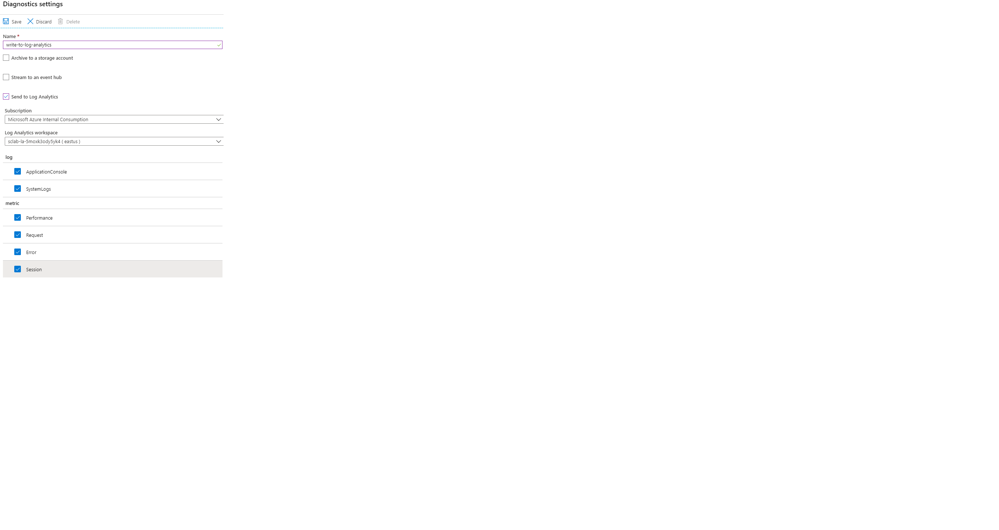

# 03 - Configure application logs

__This guide is part of the [Azure Spring Cloud training](../README.md)__

Access Spring Boot applications logs and distributed tracing to understand common issues.

---

## Configure log aggregation

There are actually three ways to access your application's logs: [Azure Storage](https://docs.microsoft.com/en-us/azure/storage/common/storage-introduction/?WT.mc_id=azurespringcloud-github-judubois), [Azure Events Hub](https://docs.microsoft.com/en-us/azure/event-hubs/?WT.mc_id=azurespringcloud-github-judubois), and [Log Analytics](https://docs.microsoft.com/en-us/azure/azure-monitor/log-query/get-started-portal/?WT.mc_id=azurespringcloud-github-judubois). We will focus here on Log Analytics as it's the most common one, and as it's integrated into Azure Spring Cloud.

[Log Analytics](https://docs.microsoft.com/en-us/azure/azure-monitor/log-query/get-started-portal/?WT.mc_id=azurespringcloud-github-judubois) is part of [Azure Monitor](https://azure.microsoft.com/en-us/services/monitor/?WT.mc_id=azurespringcloud-github-judubois), which is well-integrated into Azure Spring Cloud and which we will also use for metrics monitoring.

Having completed the setup in [Section 00](../00-setup-your-environment/README.md), you should have a Log Analytics workspace named `sclab-la-<unique string>` in your resource group for this workshop. We must now configure our Azure Spring Cloud instance to send its data to this workspace.

- Go to the "Overview" page of your Azure Spring Cloud instance and select "Diagnostic settings" in the "Monitoring" section of the navigation pane.
- Click on "Add diagnostic setting" and configure your instance to send all its logs to the Log analytics workspace that we just created.
- Fill in the values as shown here and click "Save".

⬅️ Previous guide: [02 - Build a simple Spring Boot microservice](../02-build-a-simple-spring-boot-microservice/README.md)

➡️ Next guide: [04 - Configure a Spring Cloud Config server](../04-configure-a-spring-cloud-config-server/README.md)
