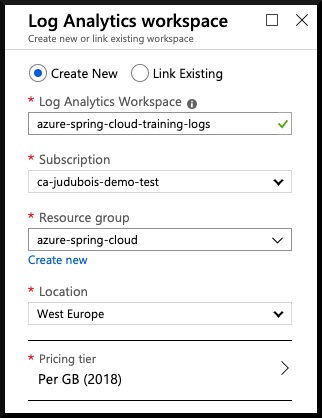

# 03 - Debug and monitor applications on Azure Spring Cloud

__This guide is part of the [Azure Spring Cloud training](../README.md)__

Access Spring Boot applications logs and metrics to understand common issues.

---

## Configure log aggregation

There are actually three ways to access your application's logs: [Azure Storage](https://docs.microsoft.com/en-us/azure/storage/common/storage-introduction/?WT.mc_id=azurespringcloud-github-judubois), [Azure Events Hub](https://docs.microsoft.com/en-us/azure/event-hubs/?WT.mc_id=azurespringcloud-github-judubois), and [Log Analytics](https://docs.microsoft.com/en-us/azure/azure-monitor/log-query/get-started-portal/?WT.mc_id=azurespringcloud-github-judubois). We will focus here on Log Analytics as it's the most common one, and as it's integrated into Azure Spring Cloud.

[Log Analytics](https://docs.microsoft.com/en-us/azure/azure-monitor/log-query/get-started-portal/?WT.mc_id=azurespringcloud-github-judubois) is part of Azure Monitor, which is well-integrated into Azure Spring Cloud, and which we will also use for metrics monitoring.

- Go to the [the Azure portal](https://portal.azure.com/?WT.mc_id=azurespringcloud-github-judubois).
- Search for "Log Analytics workspaces" in the search box.
- Create a new workspace in your Azure Spring Cloud ressource group.

- Now that the Log analytics workspace has been created, we must configure our Azure Spring Cloud cluster instance to send its data to this workspace.
- Go to the "Overview" page of your Azure Spring Cloud cluster, and select "Diagnostic settings" in the menu.
- Click on "Add diagnostic setting" and configure your cluster to send all its logs to the Log analytics workspace that we just created.

---

⬅️ Previous guide: [02 - Build a simple Spring Boot microservice](../02-build-a-simple-spring-boot-microservice/README.md)

➡️ Next guide: [04 - Configure a Spring Cloud Config server](../04-configure-a-spring-cloud-config-server/README.md)
