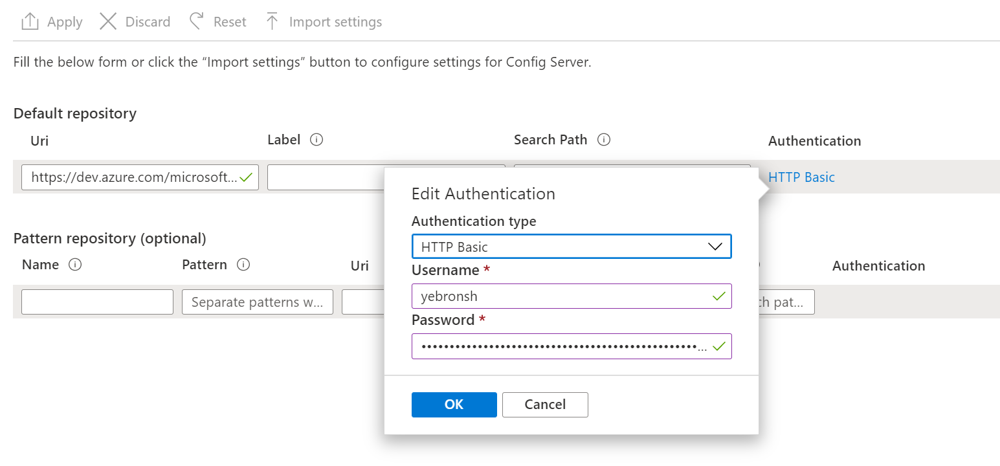

# 04a - Using Azure Repos for Azure Spring Cloud Configuration

__This guide is part of the [Azure Spring Cloud training](../README.md)__

Configure a [Spring Cloud Config Server](https://cloud.spring.io/spring-cloud-config), that will be entirely managed and supported by Azure Spring Cloud, to be used by Spring Boot microservices. 

---

## Create a Git repository for storing the application configuration

1. Create a [new Azure Repos repository](https://docs.microsoft.com/azure/devops/repos/git/create-new-repo?view=azure-devops). You can use a new project or an existing project, as long as your permissions on the project are sufficient to create, read, write, and generate credentials to repositories. The project should not be public.

1. In the new private repository, add a new `application.yml` file which will store configuration data for all our microservices.

    Typically, each Spring Boot application includes such a file within the application binaries to contain application settings. A Spring Cloud Configuration Server allow such settings to be stored at a single location and served from a single source.
    
    For the moment, our `application.yml` will just store a message to check if the configuration is successful:
    
    ```yml
    application:
        message: Configured by Azure Spring Cloud
    ```
    
    Commit and push the new file.

## Obtain Repository URL and Credentials

Azure Spring Cloud can access Git repositories that are public, secured by SSH, or secured using HTTP basic authentication. We will use that last option, as it is easier to create and manage with Azure Repos.

1. In the Azure Repos portal for your project, click the "Clone" button:

    

1. Copy the clone URL from the textbox. This URL will typically be in the form:

    ```Text
        https://<organization name>@dev.azure.com/<organization name>/<project name>/_git/<repository name>
    ```

    Remove everything after `https://` and before `dev.azure.com`, including the `@`. The resulting URL should be in the form:

    ```Text
        https://dev.azure.com/<organization name>/<project name>/_git/<repository name>
    ```

    Save this URL for use in the next section.

1. Click "Generate Git Credentials". A username and password will appear. Save these for use in the next section.


## Configure Azure Spring Cloud to access the Git repository

- Go to [the Azure portal](https://portal.azure.com/?WT.mc_id=azurespringcloud-github-judubois).
- Go to the overview page of your Azure Spring Cloud server and select "Config server" in the menu
- Configure the repository we previously created:
  - Add the repository URL that you have saved from the previous section.

  - Click on `Authentication` and select `HTTP Basic`
  - The __username__ is the username saved from the previous section
  - The __password__ is the password saved from the previous section
- Click on "Apply" and wait for the operation to succeed



## Review

We have now created a private configuration repository. We have enabled Azure Spring Cloud to create a configuration server with the configuration files from this repository.

In the next section, we will create an application that consumes this configuration, specifically the custom message we defined in `application.yml`.

---

⬅️ Previous guide: [03 - Configure application logs](../03-configure-monitoring/README.md)

⬅ GitHub version of this guide: [# 04 - Configure a Spring Cloud Config server](Readme.md)

➡️ Next guide: [05 - Build a Spring Boot microservice using Spring Cloud features](../05-build-a-spring-boot-microservice-using-spring-cloud-features/README.md)

---
