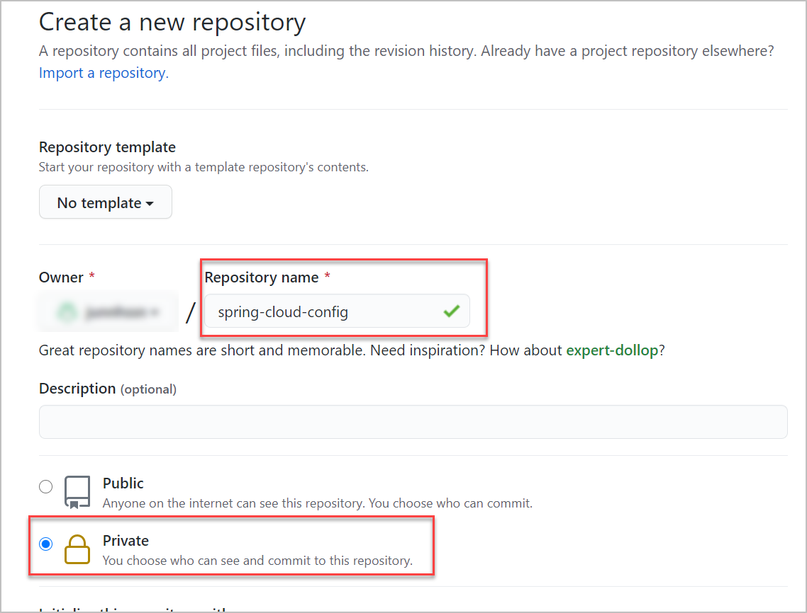
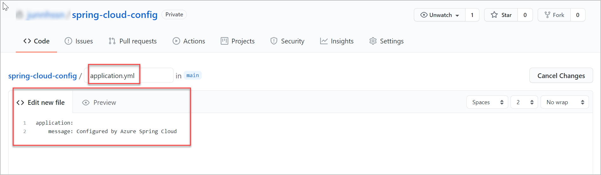
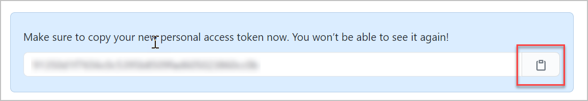
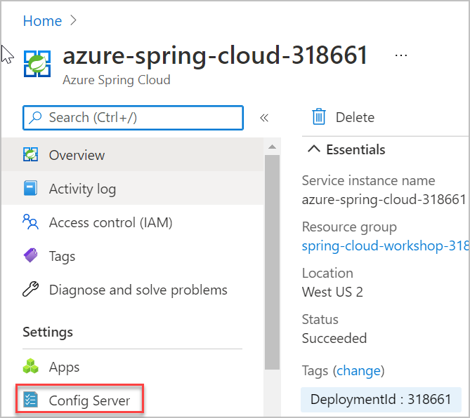

# Exercise 4 - Configure a Spring Cloud Config server

A key feature of cloud-native applications is *externalized configuration* - the ability to store, manage, and version configuration separately from the application code. In this section, we'll configure a [Spring Cloud Config Server](https://cloud.spring.io/spring-cloud-config) to enable this functionality. In the next section, you'll see how Spring Cloud Config can inject configuration from a Git repository into your application.

---

> 💡 If your organization uses Azure Repos as your source code repository, see [Using Azure Repos for Azure Spring Cloud configuration](AzureReposForConfig.md)

> ⏱ If you want to skip the step of creating a private repository, you can use this public repository instead: [https://github.com/Azure-Samples/spring-cloud-sample-public-config.git](https://github.com/Azure-Samples/spring-cloud-sample-public-config.git). __Storing configuration in a public repository is not recommended in real-world deployments.__ We offer this public repository only as a shortcut for this workshop, for example if you don't have a GitHub account. 
>
> To use this shortcut:
>  - Go to [the Azure portal](https://portal.azure.com/?WT.mc_id=azurespringcloud-github-judubois).
>  - Go to the overview page of your Azure Spring Cloud server and select "Config server" in the menu
>  - Set the repository URL: `https://github.com/Azure-Samples/spring-cloud-sample-public-config.git`
>  - Click on "Validate" and wait for the operation to succeed
>  - Click on "Apply" and wait for the operation to succeed
>  
>  We have enabled Azure Spring Cloud to create a configuration server with the configuration files from this repository. You can now proceed to the next exercise.

## Task 1 : Create a Git repository for storing the application configuration

1. On your [GitHub account](https://github.com), create a new **private** repository named **spring-cloud-config**, where the Spring Boot configurations will be stored.



2. In the new private GitHub repository, add a new `application.yml` file which will store configuration data for all our microservices.



3. Typically, each Spring Boot application includes such a file within the application binaries to contain application settings. A Spring Cloud Configuration Server allow such settings to be stored at a single location and served from a single source.

4. For the moment, our `application.yml` will just store a message to check if the configuration is successful:

```yaml
application:
    message: Configured by Azure Spring Cloud
```

5. Commit and push the new file.

## Task 2 : Create a GitHub personal token

1. Azure Spring Cloud can access Git repositories that are public, secured by SSH, or secured using HTTP basic authentication. We will use that last option, as it is easier to create and manage with GitHub.

2. Follow the [GitHub guide to create a personal token](https://help.github.com/en/articles/creating-a-personal-access-token-for-the-command-line) and save your token. When asked to select scopes, check off the entire "repo" section (as shown below) and nothing else.


3. Once the token is generated, Copy the personal access token and leave that tab open until the end of this section.



## Task 3 : Configure Azure Spring Cloud to access the Git repository

1. Go to [the Azure portal](https://portal.azure.com/?WT.mc_id=azurespringcloud-github-judubois).

2. Go to the overview page of your Azure Spring Cloud server and select "Config server" in the menu



3. Configure the repository we previously created:

  - Add the repository URL, for example `https://github.com/Azure-Samples/spring-cloud-sample-public-config.git`

     >💡 Make sure you include the `.git` ending in the URL.

  - Click on `Authentication` and select `HTTP Basic`

  - The __username__ is your GitHub login name
 
  - The __password__ is the personal token we created in the previous section

4. Click on "Validate" and wait for the operation to succeed  

5. Click on "Apply" and wait for the operation to succeed


## Review

We have now created a private configuration repository. We have enabled Azure Spring Cloud to create a configuration server with the configuration files from this repository.

In the next section, we will create an application that consumes this configuration, specifically the custom message we defined in `application.yml`.

---
