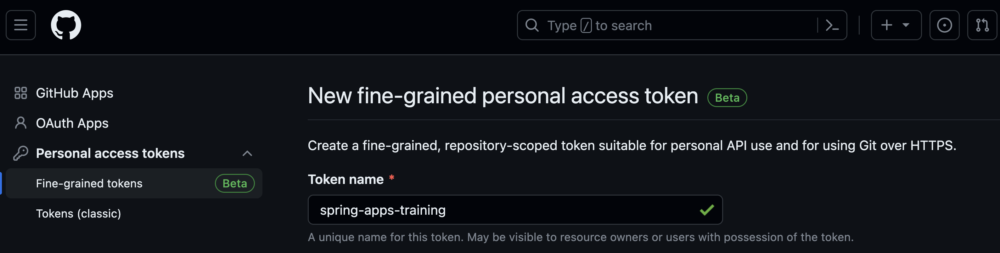
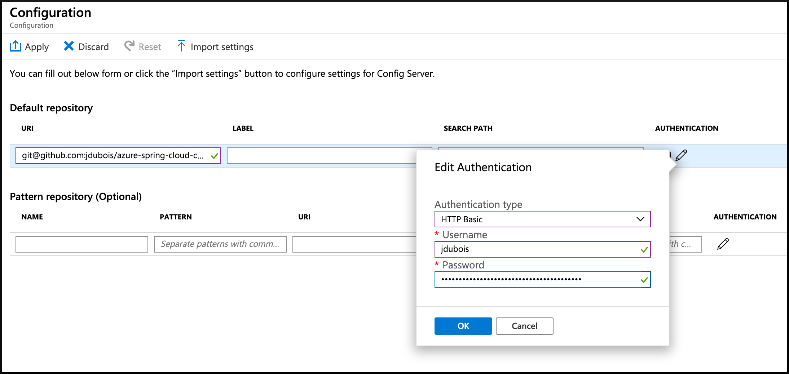

# 04 - Configure a Spring Cloud Config server

__This guide is part of the [Azure Spring Cloud training](../README.md)__

Configure a [Spring Cloud Config Server](https://cloud.spring.io/spring-cloud-config), that will be entirely managed and supported by Azure Spring Cloud, to be used by Spring Boot microservices.

---

## Create a Git repository for storing the application configuration

On your [GitHub account](https://github.com), create a new **private** repository where the Spring Boot configurations will be stored.

> We will store configuration information, which should not be shared in public, so be careful to create a private repository

In this repository, add a new `application.yml` file which will store configuration data for all our microservices. For the moment, it will just store a message to check if the configuration is successful:

```
application:
    message: Configured by Azure Spring Cloud
```

## Create a GitHub personal token

Azure Spring Cloud can access Git repositories that are public (not recommended!), secured by SSH, or secured using HTTP basic authentication. We will use that last option, as it is easier to create and manage with GitHub.

Follow the [GitHub guide to create a personal token](https://help.github.com/en/articles/creating-a-personal-access-token-for-the-command-line) and save your token, as we will use it in the next section.



## Configure Azure Spring Cloud to access the Git repository

- Go to the [the Azure portal](https://portal.azure.com/?WT.mc_id=azurespringcloud-github-judubois).
- Go to the overview page of your Azure Spring Cloud server, and select "Config server" in the menu
- Configure the repository we previously created:
  - Add the repository URL, for example `https://github.com/jdubois/azure-spring-cloud-config.git``
  - Click on `Authentication` and select `HTTP Basic``
  - The username is your GitHub login name
  - The password is the personal token we created in the previous section
- Click on "Apply" and wait for the operation to succeeed



---

⬅️ Previous guide: [03 - Configure application logs](../03-configure-application-logs/README.md)

➡️ Next guide: [05 - Build a Spring Boot microservice using Spring Cloud features](../05-build-a-spring-boot-microservice-using-spring-cloud-features/README.md)
