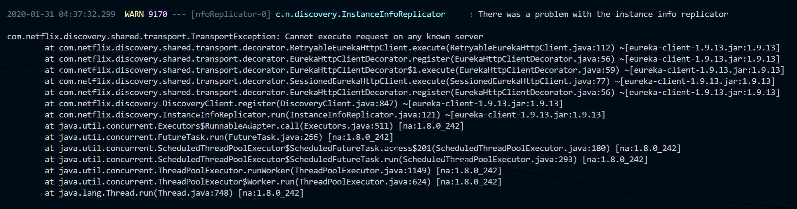
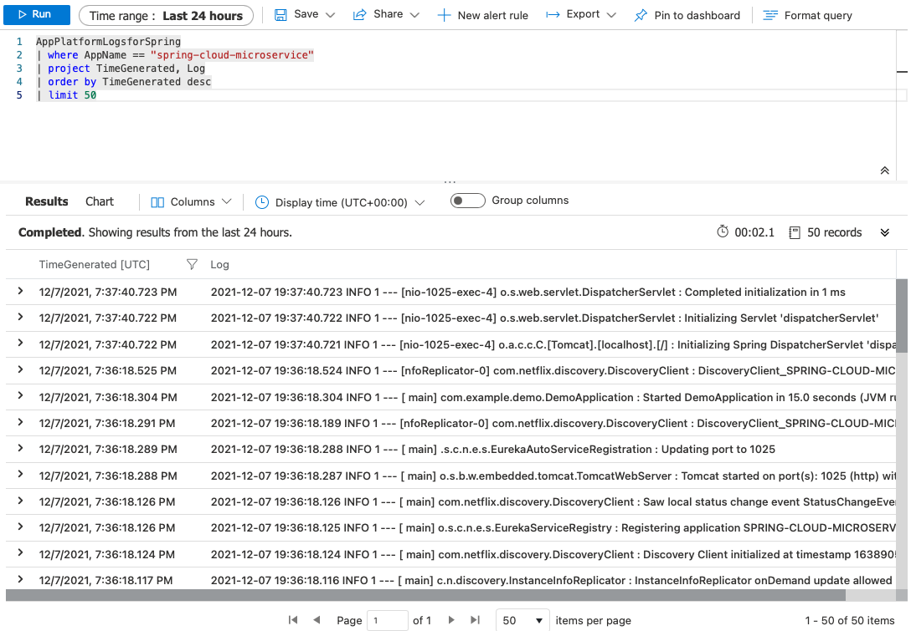

# 05 - Build a Spring Boot microservice using Spring Cloud features

__This guide is part of the [Azure Spring Cloud training](../README.md)__

Build a Spring Boot microservice that is cloud-enabled: it uses a Spring Cloud Service Registry and a [Spring Cloud Config Server](https://cloud.spring.io/spring-cloud-config) which are both managed and supported by Azure Spring Cloud.

---

## What we are going to build

This guide builds upon the previous guides: we are going to build again a simple Spring Boot microservice like in [02 - Build a simple Spring Boot microservice](../02-build-a-simple-spring-boot-microservice/README.md), but this time it will use two major Spring Cloud features:

- It will be connected to a Spring Cloud Service Registry so it can discover other microservices, as well as being discovered itself!

- It will get its configuration from the Spring Cloud Config server that we configured in the previous guide, [04 - Configure a Spring Cloud Config server](../04-configure-a-spring-cloud-config-server/README.md)

For both features, it will just be a matter of adding an official Spring Boot starter, and Azure Spring Cloud will take care of everything else.

## Create a simple Spring Cloud microservice

The microservice that we create in this guide is [available here](spring-cloud-microservice/).

To create our microservice, we will use [https://start.spring.io/](https://start.spring.io/) with the command line:

```bash
curl https://start.spring.io/starter.tgz -d dependencies=web,cloud-eureka,cloud-config-client -d baseDir=spring-cloud-microservice -d bootVersion=2.3.1.RELEASE | tar -xzvf -
```

> This time, we add the `Eureka Discovery Client` and the `Config Client` Spring Boot starters, which will respectively automatically trigger the use of Spring Cloud Service Registry and the Spring Cloud Config Server.

## Add a "cloud" Maven profile

In order to securely connect to Azure Spring Cloud services (Spring Cloud Service Registry and Spring Cloud Config), we need to add a specific Maven dependency. We will add in a specific Maven profile, so it doesn't pollute the rest of the application.

At the end of the application's `pom.xml` file (just before the closing `</project>` XML node), add the following code:

```xml
    <profiles>
        <profile>
            <id>cloud</id>
            <dependencies>
                <dependency>
                    <groupId>com.microsoft.azure</groupId>
                    <artifactId>spring-cloud-starter-azure-spring-cloud-client</artifactId>
                    <version>2.2.0</version>
                </dependency>
            </dependencies>
        </profile>
    </profiles>
```

## Add a new Spring MVC Controller

Next to the DemoApplication class, create a new class called `HelloController` with the following content:

```java
package com.example.demo;

import org.springframework.beans.factory.annotation.Value;
import org.springframework.web.bind.annotation.GetMapping;
import org.springframework.web.bind.annotation.RestController;

@RestController
public class HelloController {

    @Value("${application.message:Not configured by a Spring Cloud Server}")
    private String message;

    @GetMapping("/hello")
    public String hello() {
        return message;
    }
}
```

## Test the project locally

Before deploying the microservice to Azure Spring Cloud, let's run it locally.

>💡 Do not be alarmed when you see exception stack traces:
> 
>Spring Cloud is attempting to contact a local configuration server, which we have not provided. The application will still start using any available local settings and defaults.

To run `simple-cloud-microservice` locally:

```bash
cd spring-cloud-microservice
./mvnw spring-boot:run &
cd ..
```

Requesting the `/hello` endpoint should return the "Not configured by a Spring Cloud Server" message.

```bash
curl http://127.0.0.1:8080/hello
```

Kill the locally running microservice:

```bash
kill %1
```

## Create and deploy the application on Azure Spring Cloud

As in [02 - Build a simple Spring Boot microservice](../02-build-a-simple-spring-boot-microservice/README.md), create a specific `spring-cloud-microservice` application in your Azure Spring Cloud instance:

```bash
az spring-cloud app create -n spring-cloud-microservice
```

You can now build your "spring-cloud-microservice" project and send it to Azure Spring Cloud:

```bash
cd spring-cloud-microservice
./mvnw clean package -DskipTests -Pcloud
az spring-cloud app deploy -n spring-cloud-microservice --jar-path target/demo-0.0.1-SNAPSHOT.jar
cd ..
```

## Test the project in the cloud

Go to [the Azure portal](https://portal.azure.com/?WT.mc_id=azurespringcloud-github-judubois):

- Look for your Azure Spring Cloud instance in your resource group
- Go to "Apps"
  - Verify that `spring-cloud-microservice` has a `Discovery status` which says `UP(1),DOWN(0)`. This shows that it is correctly registered in Spring Cloud Service Registry.
  - Select `spring-cloud-microservice` to have more information on the microservice.
- Copy/paste the "Test Endpoint" that is provided.

You can now use cURL again to test the `/hello` endpoint, this time it is served by Azure Spring Cloud and configured using the Spring Config Server from [04 - Configure a Spring Cloud Config server](../04-configure-a-spring-cloud-config-server/README.md).

As a result, requesting the `/hello` endpoint should return the message that we configured in the `application.yml` file, coming from the Spring Cloud Config Server:

```bash
Configured by Azure Spring Cloud
```

## Stream application logs

When you run an application on your machine, you can see its output in the console. When you run a microservice on Azure Spring Cloud, you can also see its console output through Azure CLI:

```bash
az spring-cloud app logs --name spring-cloud-microservice -f
```

You should see the console output of `spring-cloud-microservice` scroll by on your terminal:


Press CTRL+C to stop following the output and return to the shell.

## Query application logs

Streaming the console output as we just did may be helpful in understanding the immediate state of a microservice. However, sometimes it's necessary to look further into the past or to look for something specific. This is easily done with Log Analytics. In section 3, we enabled log aggregation in Azure Log Analytics. Such settings changes can take 1-2 minutes to apply, so by now, you should be able to query Azure Log Analytics.

[Open Azure Portal](https://portal.azure.com/?WT.mc_id=azurespringcloud-github-judubois) and navigate to your Azure Spring Cloud instance. Click on "Logs". This is a shortcut to the Log Analytics workspace that was created earlier. If a tutorial appears, feel free to skip it for now.

This workspace allows you to run queries on the aggregated logs. The most common query is to get the latest log from a specific application:

__Important:__ Spring Boot applications logs have a dedicated `AppPlatformLogsforSpring` type.

Here is how to get its 50 most recent logs of the `AppPlatformLogsforSpring` type for the microservice we just deployed:

Insert this text in the text area that states "Type your queries here or click on of the example queries to start".  Click the text of the query, then click "Run".

```sql
AppPlatformLogsforSpring
| where AppName == "spring-cloud-microservice"
| project TimeGenerated, Log
| order by TimeGenerated desc
| limit 50
```



>💡 It can also take 1-2 minutes for the console output of an Azure Spring Cloud microservice to be read into Log Analytics.

## Conclusion

Congratulations, you have deployed a complete Spring Cloud microservice, using Spring Cloud Service Registry and Spring Cloud Config Server!

If you need to check your code, the final project is available in the ["spring-cloud-microservice" folder](spring-cloud-microservice/).

Here is the final script to build and deploy everything that was done in this guide:

```bash
curl https://start.spring.io/starter.tgz -d dependencies=web,cloud-eureka,cloud-config-client -d baseDir=spring-cloud-microservice -d bootVersion=2.3.1.RELEASE | tar -xzvf -
cd spring-cloud-microservice
cat > pom.xml << EOF
<?xml version="1.0" encoding="UTF-8"?>
<project xmlns="http://maven.apache.org/POM/4.0.0" xmlns:xsi="http://www.w3.org/2001/XMLSchema-instance"
    xsi:schemaLocation="http://maven.apache.org/POM/4.0.0 https://maven.apache.org/xsd/maven-4.0.0.xsd">
    <modelVersion>4.0.0</modelVersion>
    <parent>
        <groupId>org.springframework.boot</groupId>
        <artifactId>spring-boot-starter-parent</artifactId>
        <version>2.3.1.RELEASE</version>
        <relativePath/> <!-- lookup parent from repository -->
    </parent>
    <groupId>com.example</groupId>
    <artifactId>demo</artifactId>
    <version>0.0.1-SNAPSHOT</version>
    <name>demo</name>
    <description>Demo project for Spring Boot</description>

    <properties>
        <java.version>1.8</java.version>
        <spring-cloud.version>Hoxton.SR5</spring-cloud.version>
    </properties>

    <dependencies>
        <dependency>
            <groupId>org.springframework.boot</groupId>
            <artifactId>spring-boot-starter-web</artifactId>
        </dependency>
        <dependency>
            <groupId>org.springframework.cloud</groupId>
            <artifactId>spring-cloud-starter-config</artifactId>
        </dependency>
        <dependency>
            <groupId>org.springframework.cloud</groupId>
            <artifactId>spring-cloud-starter-netflix-eureka-client</artifactId>
        </dependency>

        <dependency>
            <groupId>org.springframework.boot</groupId>
            <artifactId>spring-boot-starter-test</artifactId>
            <scope>test</scope>
        </dependency>
    </dependencies>

    <dependencyManagement>
        <dependencies>
            <dependency>
                <groupId>org.springframework.cloud</groupId>
                <artifactId>spring-cloud-dependencies</artifactId>
                <version>\${spring-cloud.version}</version>
                <type>pom</type>
                <scope>import</scope>
            </dependency>
        </dependencies>
    </dependencyManagement>

    <build>
        <plugins>
            <plugin>
                <groupId>org.springframework.boot</groupId>
                <artifactId>spring-boot-maven-plugin</artifactId>
            </plugin>
        </plugins>
    </build>

    <profiles>
        <profile>
            <id>cloud</id>
            <dependencies>
                <dependency>
                    <groupId>com.microsoft.azure</groupId>
                    <artifactId>spring-cloud-starter-azure-spring-cloud-client</artifactId>
                    <version>2.2.0</version>
                </dependency>
            </dependencies>
        </profile>
    </profiles>
</project>
EOF
cat > HelloController.java << EOF
package com.example.demo;

import org.springframework.beans.factory.annotation.Value;
import org.springframework.web.bind.annotation.GetMapping;
import org.springframework.web.bind.annotation.RestController;

@RestController
public class HelloController {

    @Value("\${application.message:Not configured by a Spring Cloud Server}")
    private String message;

    @GetMapping("/hello")
    public String hello() {
        return message;
    }
}
EOF
mv HelloController.java src/main/java/com/example/demo/HelloController.java
az spring-cloud app create -n spring-cloud-microservice
./mvnw clean package -DskipTests -Pcloud
az spring-cloud app deploy -n spring-cloud-microservice --jar-path target/demo-0.0.1-SNAPSHOT.jar
cd ..
```

---

⬅️ Previous guide: [04 - Configure a Spring Cloud Config server](../04-configure-a-spring-cloud-config-server/README.md)

➡️ Next guide: [06 - Build a reactive Spring Boot microservice using Cosmos DB](../06-build-a-reactive-spring-boot-microservice-using-cosmosdb/README.md)
