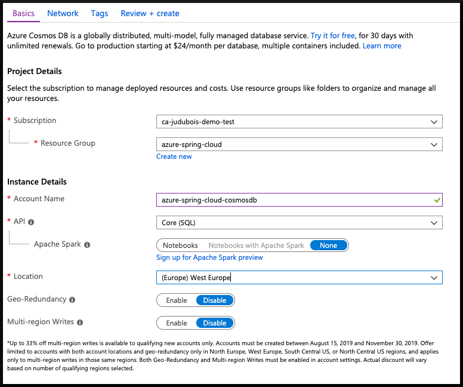
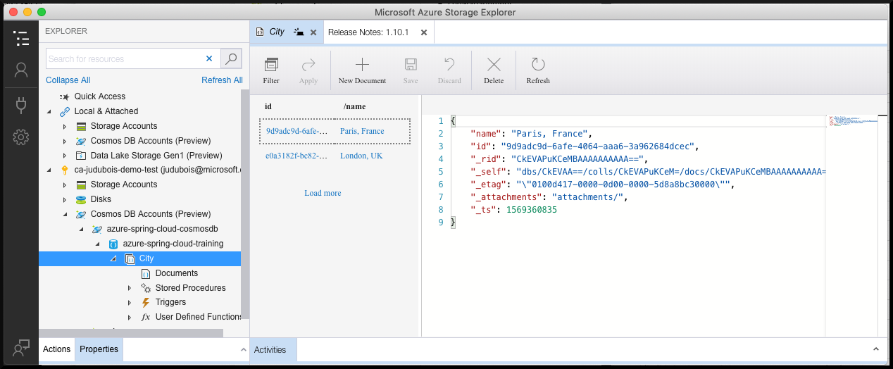
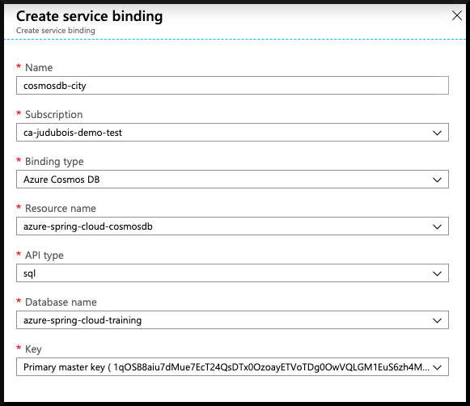

# 06 - Build a reactive Spring Boot microservice using Cosmos DB

__This guide is part of the [Azure Spring Cloud training](../README.md)__

Build a reactive Spring Boot microservice, that uses the [Spring reactive stack](https://docs.spring.io/spring/docs/current/spring-framework-reference/web-reactive.html) and is binded to a [Cosmos DB database](https://docs.microsoft.com/en-us/azure/cosmos-db/?WT.mc_id=azurespringcloud-github-judubois) in order to access a globally-distributed database without optimum performance.

---

## Create a Cosmos DB database

- Go to the [the Azure portal](https://portal.azure.com/?WT.mc_id=azurespringcloud-github-judubois) and look for "Cosmos DB" in the search box.
- Create a new Cosmos DB account
  - Keep the default "Core (SQL)" API
  - Select the same location as your Azure Spring Cloud cluster



> We are going to use the Web interface to add some data, but an easiest way to do it is to use
> [Microsoft Azure Storage Explorer](https://azure.microsoft.com/en-us/features/storage-explorer/?WT.mc_id=azurespringcloud-github-judubois)
> It's a free application that runs on Windows, Mac OS X and Linux!

- Once this Cosmo DB account is created, select it and click on the "Keys" menu item, and copy the account's primary key for later usage.
- Click on the "Data Explorer" menu item
  - Create a new database called `azure-spring-cloud-training`
  - In that container, create a new container called `City`
  - Input `/name` as partition key

In that container, insert some sample items:

```json
{
    "name": "Paris, France"
}
```
```json
{
    "name": "London, UK"
}
```



## Create a Spring Webflux microservice

The microservice that we create in this guide is [available here](city-service/).

To create our microservice, we will use [https://start.spring.io/](https://start.spring.io/) with the command line:

```
curl https://start.spring.io/starter.tgz -d dependencies=webflux,cloud-eureka,cloud-config-client -d baseDir=city-service | tar -xzvf -
```

> We use the `Spring Webflux`, `Eureka Discovery Client` and the `Config Client` Spring Boot starters.

## Add the Cosmos DB v3 API

In the application's `pom.xml` file, add the Cosmos DB dependency just after the `spring-cloud-starter-netflix-eureka-client` dependency:

```xml
        <dependency>
            <groupId>com.microsoft.azure</groupId>
            <artifactId>azure-cosmos</artifactId>
            <version>3.2.0</version>
        </dependency>
```

## Add a "cloud" Maven profile

*To deploy to Azure Spring Cloud, we add a "cloud" Maven profile like in the previous guide [05 - Build a Spring Boot microservice using Spring Cloud features](../05-build-a-spring-boot-microservice-using-spring-cloud-features/README.md)*

At the end of the application's `pom.xml` file (just before the closing `</project>` XML node), add the following code:

```xml
	<profiles>
		<profile>
			<id>cloud</id>
			<repositories>
				<repository>
					<id>nexus-snapshots</id>
					<url>https://oss.sonatype.org/content/repositories/snapshots/</url>
					<snapshots>
						<enabled>true</enabled>
					</snapshots>
				</repository>
			</repositories>
			<dependencies>
				<dependency>
					<groupId>com.microsoft.azure</groupId>
					<artifactId>spring-cloud-starter-azure-spring-cloud-client</artifactId>
					<version>2.1.0-SNAPSHOT</version>
				</dependency>
			</dependencies>
		</profile>
	</profiles>
```

## Add Spring reactive code to get the data from the database

Next to the `DemoApplication` class, create a `City` domain object:

```java
package com.example.demo;

class City {

    private String name;

    public String getName() {
        return name;
    }

    public void setName(String name) {
        this.name = name;
    }
}
```

Then, create a new `CityController` class that will be used to query the database.

> This class will get its Cosmos DB configuration from the Azure Spring Cloud service binding that we will configure later.
> If you want to test locally, you can create a specific `application-dev.yml` configuration file that would only be triggered with a specific `dev` Spring profile. Of course, we don't recommend storing this configuration data in your Git repository.

```java
package com.example.demo;

import com.azure.data.cosmos.CosmosClient;
import com.azure.data.cosmos.CosmosContainer;
import com.azure.data.cosmos.FeedOptions;
import org.springframework.beans.factory.annotation.Value;
import org.springframework.web.bind.annotation.GetMapping;
import org.springframework.web.bind.annotation.RestController;
import reactor.core.publisher.Flux;

import javax.annotation.PostConstruct;
import java.util.ArrayList;
import java.util.List;

@RestController
public class CityController {

    @Value("${azure.cosmosdb.uri}")
    private String cosmosDbUrl;

    @Value("${azure.cosmosdb.key}")
    private String cosmosDbKey;

    @Value("${azure.cosmosdb.database}")
    private String cosmosDbDatabase;

    private CosmosContainer container;

    @PostConstruct
    public void init() {
        container = CosmosClient.builder()
                .endpoint(cosmosDbUrl)
                .key(cosmosDbKey)
                .build()
                .getDatabase(cosmosDbDatabase)
                .getContainer("City");
    }

    @GetMapping("/cities")
    public Flux<List<City>> getCities() {
        FeedOptions options = new FeedOptions();
        options.enableCrossPartitionQuery(true);
        return container.queryItems("SELECT TOP 20 * FROM City c", options)
                .map(i -> {
                    List<City> results = new ArrayList<>();
                    i.results().forEach(props -> {
                        City city = new City();
                        city.setName(props.getString("name"));
                        results.add(city);
                    });
                    return results;
                });
    }
}
```

## Create the application on Azure Spring Cloud

As in [02 - Build a simple Spring Boot microservice](../02-build-a-simple-spring-boot-microservice/README.md), create a specific `city-service` application in your Azure Spring Cloud cluster:

```
az spring-cloud app create -n city-service
```

## Bind the Cosmos DB database to the application

Azure Spring Cloud can automatically bind the Cosmos DB database we created to our microservice.

- Go to "App Management" in your Azure Spring Cloud cluster.
- Select the `city-service` application
- Go to `Service bindings`
- Click on `Create service binding``
  - Give your binding a name, for example `cosmosdb-city`
  - Select the Cosmos DB account and database we created, and keep the default `sql` API type
  - In the drop-down list, select the primary master key
  - Click on `Create` to create the database binding



## Deploy the application

You can now build your "city-service" project and send it to Azure Spring Cloud:

```
./mvnw package -DskipTests -Pcloud
az spring-cloud app deploy -n city-service --jar-path target/demo-0.0.1-SNAPSHOT.jar
```

## Test the project in the cloud

- Go to "App Management" in your Azure Spring Cloud cluster.
  - Verify that `city-service` has a `Discovery status` which says `UP(1),DOWN(0)`. This shows that it is correctly registered in Eureka.
  - Select `city-service` to have more information on the microservice.
- Copy/paste the "Test Endpoint" that is provided.

You can now use cURL to test the `/cities` endpoint, and it should give you the list of cities you created. For example, if you only created `Paris, France` and `London, UK` like it is shown in this guide, you should get:

```
[[{"name":"Paris, France"},{"name":"London, UK"}]]
```

If you need to check your code, the final project is available in the ["city-service" folder](city-service/).

---

⬅️ Previous guide: [05 - Build a Spring Boot microservice using Spring Cloud features](../05-build-a-spring-boot-microservice-using-spring-cloud-features/README.md)

➡️ Next guide: [07 - Build a Spring Boot microservice using MySQL](../07-build-a-spring-boot-microservice-using-mysql/README.md)
