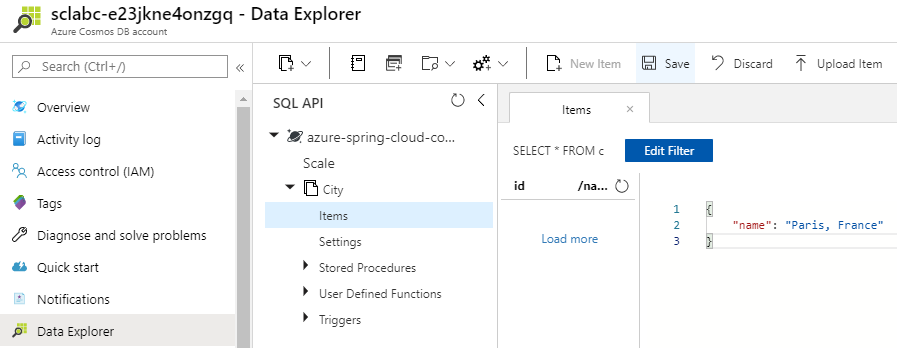
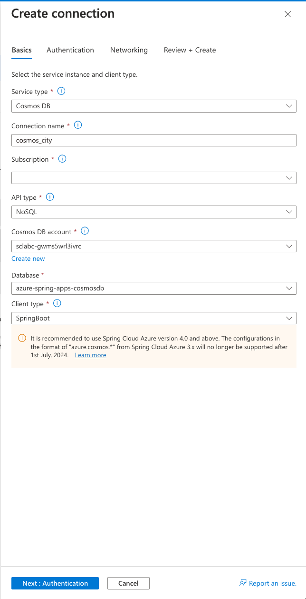
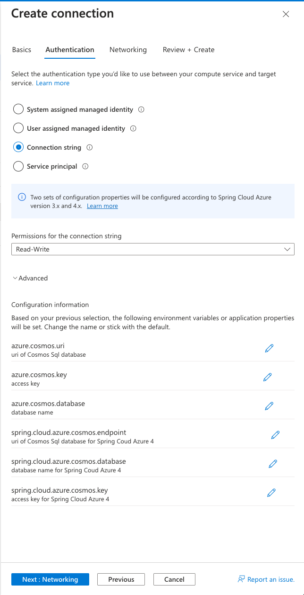
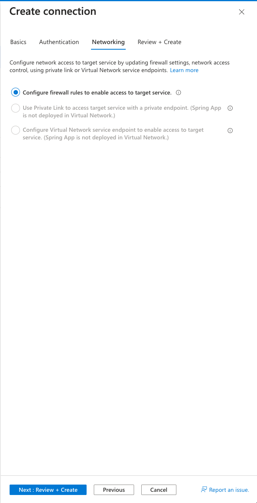

# 06 - Build a reactive Spring Boot microservice using Cosmos DB

__This guide is part of the [Azure Spring Apps training](../README.md)__

In this section, we'll build an application that uses a [Cosmos DB database](https://docs.microsoft.com/en-us/azure/cosmos-db/?WT.mc_id=azurespringcloud-github-judubois) in order to access a globally-distributed database with optimum performance.

We'll use the reactive programming paradigm to build our microservice in this section, leveraging the [Spring reactive stack](https://docs.spring.io/spring/docs/current/spring-framework-reference/web-reactive.html). In contrast, we'll build a more traditional data-driven microservice in the next section.

---

## Prepare the Azure Cosmos DB database

From Section 00, you should already have a CosmosDB account named `sclabc-<unique string>`.

- Click on the "Data Explorer" menu item
  - Expand the container named `azure-spring-apps-cosmosdb`.
  - In that container, expand the container named `City`.
  - Click on "Items" and use the "New Item" button to create some sample items using the contents below:

    ```json
    {
        "name": "Paris, France"
    }
    ```

    ```json
    {
        "name": "London, UK"
    }
    ```



## Create a Spring WebFlux microservice

The microservice that we create in this guide is [available here](city-service/).

To create our microservice, we will invoke the Spring Initalizr service from the command line:

```bash
curl https://start.spring.io/starter.tgz -d type=maven-project -d dependencies=webflux,cloud-eureka,cloud-config-client -d baseDir=city-service -d bootVersion=3.1.3 -d javaVersion=17 | tar -xzvf -
```

> We use the `Spring WebFlux`, `Eureka Discovery Client` and the `Config Client` Spring Boot starters.

## Add the Azure Cosmos DB API

In the application's `pom.xml` file, add the Azure Cosmos DB dependency just after the `spring-cloud-starter-netflix-eureka-client` dependency:

```xml
        <dependency>
            <groupId>com.azure</groupId>
            <artifactId>azure-cosmos</artifactId>
            <version>4.47.0</version>
        </dependency>
```

## Add Spring reactive code to get the data from the database

Next to the `DemoApplication` class, create a `City` domain object:

```java
package com.example.demo;

class City {

    private String name;

    public String getName() {
        return name;
    }

    public void setName(String name) {
        this.name = name;
    }
}
```

Then, in the same location, create a new `CityController.java` file that
contains the code that will be used to query the database.

> The CityController class will get its Cosmos DB configuration from the Azure Spring Apps Service Connector that we will configure later.

```java
package com.example.demo;

import com.azure.cosmos.CosmosAsyncContainer;
import com.azure.cosmos.CosmosClientBuilder;
import com.azure.cosmos.models.CosmosQueryRequestOptions;
import com.azure.cosmos.models.FeedResponse;

import org.springframework.beans.factory.annotation.Value;
import org.springframework.web.bind.annotation.GetMapping;
import org.springframework.web.bind.annotation.RestController;
import reactor.core.publisher.Flux;

import jakarta.annotation.PostConstruct;
import java.util.List;

@RestController
public class CityController {

    @Value("${azure.cosmos.uri}")
    private String cosmosDbUrl;

    @Value("${azure.cosmos.key}")
    private String cosmosDbKey;

    @Value("${azure.cosmos.database}")
    private String cosmosDbDatabase;

    private CosmosAsyncContainer container;

    @PostConstruct
    public void init() {
        container = new CosmosClientBuilder()
                .endpoint(cosmosDbUrl)
                .key(cosmosDbKey)
                .buildAsyncClient()
                .getDatabase(cosmosDbDatabase)
                .getContainer("City");
    }

    @GetMapping("/cities")
    public Flux<List<City>> getCities() {
        CosmosQueryRequestOptions options = new CosmosQueryRequestOptions();
        return container.queryItems("SELECT TOP 20 * FROM City c", options, City.class)
                .byPage()
                .map(FeedResponse::getResults);
    }
}
```

## Create the application on Azure Spring Apps

As in [02 - Build a simple Spring Boot microservice](../02-build-a-simple-spring-boot-microservice/README.md), create a specific `city-service` application in your Azure Spring Apps instance:

```bash
az spring app create -n city-service --runtime-version Java_17
```

## Connect the Azure Cosmos DB database to the application

Azure Spring Apps can automatically connect the Cosmos DB database we created to our microservice.

- Go to "Apps" in your Azure Spring Apps instance.
- Select the `city-service` application
- Go to `Service Connector`
- Click on `+ Create`
- Choose `Cosmos DB` as the Service type
- Give your Connection a name, for example `cosmos_city`
- Select the `NoSQL` API type
- Select the Cosmos DB account and Database we created in the initial 00 setup step
- Verify that the Client type is `SpringBoot`
- Click the `Next: Authentication` button



- Select `Connection string` for the authentication type
- Expand the `Advanced` tag below to verify the property names injected into the connected app
- Click the `Next: Networking` button



- Leave `Configure firewall rules to enable access to target service` selected
- Click the `Next: Review + Create` button



- Once validation passes, click the `Create` button to create the Service Connector


## Deploy the application

You can now build your "city-service" project and send it to Azure Spring Apps:

```bash
cd city-service
./mvnw clean package -DskipTests
az spring app deploy -n city-service --artifact-path target/demo-0.0.1-SNAPSHOT.jar
cd ..
```

## Test the project in the cloud

- Go to "Apps" in your Azure Spring Apps instance.
  - Verify that `city-service` has a `Registration status` which says `1/1`. This shows that it is correctly registered in Spring Cloud Service Registry.
  - Select `city-service` to have more information on the microservice.
- Copy/paste the "Test Endpoint" that is provided.

You can now use cURL to test the `/cities` endpoint, and it should give you the list of cities you created. For example, if you only created `Paris, France` and `London, UK` as is shown in this guide, you should get:

```json
[[{"name":"Paris, France"},{"name":"London, UK"}]]
```

If you need to check your code, the final project is available in the ["city-service" folder](city-service/).

---

⬅️ Previous guide: [05 - Build a Spring Boot microservice using Spring Cloud features](../05-build-a-spring-boot-microservice-using-spring-cloud-features/README.md)

➡️ Next guide: [07 - Build a Spring Boot microservice using MySQL](../07-build-a-spring-boot-microservice-using-mysql/README.md)
