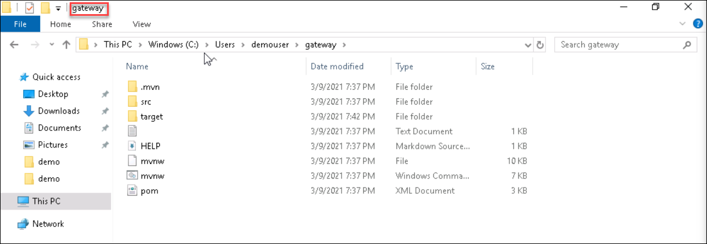
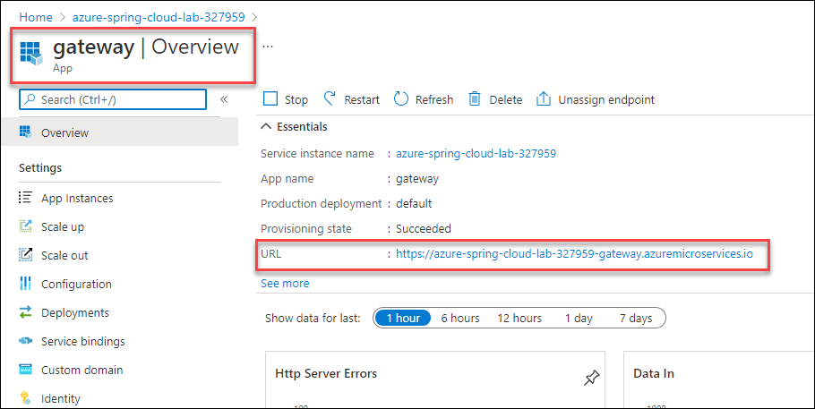
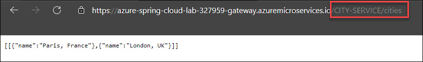
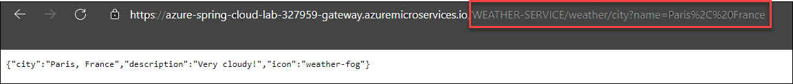

# Exercise 8 - Build a Spring Cloud Gateway

A Spring Cloud gateway allows you to selectively expose your microservices and to route traffic to them and among them. In this section, we will create a Spring Cloud Gateway that will expose the microservices we created in the preceding two sections.

---

## Task 1 : Create a Spring Cloud Gateway

1. To create our gateway, we will invoke the Spring Initalizer service from the command line:

```bash
curl https://start.spring.io/starter.tgz -d dependencies=cloud-gateway,cloud-eureka,cloud-config-client -d baseDir=gateway -d bootVersion=2.3.8 -d javaVersion=1.8 | tar -xzvf -
```
2. Navigate to the path `C:\Users\demouser\gateway` to find the gateway folder 



    > We use the `Cloud Gateway`, `Eureka Discovery Client` and the `Config Client` components.

## Task 2 : Configure the application

1. Navigate to `C:\Users\demouser\gateway\src\main\resources` and rename the `application.properties` to `application.yml` and add the following configuration:

```yaml
spring:
  main:
    allow-bean-definition-overriding: true
  cloud:
    gateway:
      discovery:
        locator:
          enabled: true
      globalcors:
        corsConfigurations:
          '[/**]':
            allowedOrigins: "*"
            allowedMethods:
              - GET

```

  - The `spring.main.allow-bean-definition-overriding=true` part is to configure Spring Cloud Gateway to use the Spring Cloud Discovery Server bean configured in the Azure Spring Cloud Client library.
 
  - The `spring.cloud.gateway.discovery.locator.enabled=true` part is to configure Spring Cloud Gateway to use the Spring Cloud Service Registry to discover the available microservices.
  
  - The `spring.cloud.gateway.globalcors.corsConfiguration` part is to allow CORS requests to our gateway. This will be helpful in the next guide, when we will add a front-end that is not hosted on Azure Spring Cloud.

## Task 3 : Create the application on Azure Spring Cloud

1. Create a specific `gateway` application in your Azure Spring Cloud instance. As this application is a gateway, we add the `--is-public true` flag so it is exposed publicly.

```bash
az spring-cloud app create -n gateway --is-public true
```

## Task 4 : Deploy the application

1. You can now build your "gateway" project and send it to Azure Spring Cloud:

```bash
cd gateway
./mvnw clean package -DskipTests
az spring-cloud app deploy -n gateway --jar-path target/demo-0.0.1-SNAPSHOT.jar
cd ..
```

## Task 5 : Test the project in the cloud

1. Go to "Apps" in your Azure Spring Cloud instance.

2. Verify that `gateway` has a `Registration status` which says `1/1`. This shows that it is correctly registered in the Spring Cloud Service Registry.

3. Select `gateway` to have more information on the microservice.

4. Copy the public URL that is provided (there is a "Test Endpoint" like for microservices, but the gateway is directly exposed on the Internet, so let's use the public URL). Keep this URL handy for subsequent sections.



5. As the gateway is connected to the Spring Cloud Service Registry, it should have automatically opened routes to the available microservices, with URL paths in the form of `/MICROSERVICE-ID/**`:
[The MICROSERVICE-ID must be in capital letters]

6. Test the `city-service` microservice endpoint by doing: `curl https://XXXXXXXX-gateway.azuremicroservices.io/CITY-SERVICE/cities` (replacing XXXXXXXX with the name of your Azure Spring Cloud instance)



7. Test the `weather-service` microservice endpoint by doing: `curl 'https://XXXXXXXX-gateway.azuremicroservices.io/WEATHER-SERVICE/weather/city?name=Paris%2C%20France'` (replacing XXXXXXXX by the name of your gateway)



---
