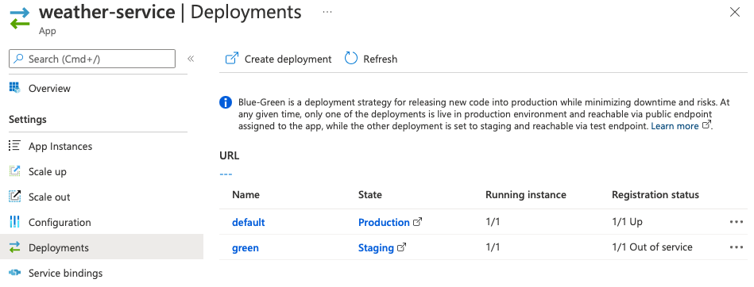
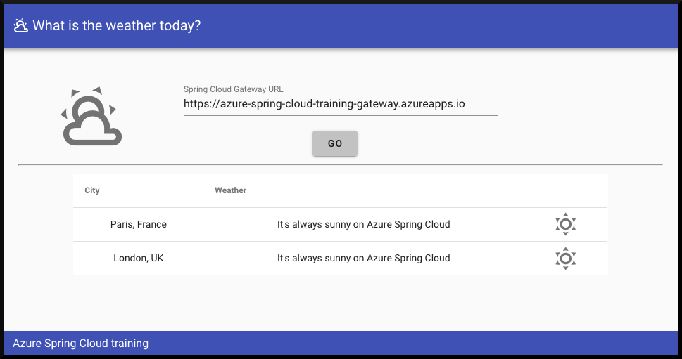

# Exercise 10 - Blue/Green deployment

The blue-green deployment pattern allows you to test latest application changes on production infrastructure, but without exposing the changes to consumers until your testing is complete. In this section, we'll perform a blue-green deployment with Azure CLI. Although we will go through the deployment steps manually, the Azure CLI commands we'll use can be automated in a CI/CD pipeline.

---

We are going to deploy a new release of the "weather-service" microservice that was developed in exercise 7.

## Task 1 : Modify the current application

1. Navigate to `C:\Users\demouser\weather-service\src\main\java\com\example\demo` and open the `WeatherController` class and modify its `getWeatherForCity()` method so it always returns sunny weather (this will be an easy-to-spot graphical view of our modifications in the code):

```java
package com.example.demo;

import org.springframework.stereotype.Controller;
import org.springframework.web.bind.annotation.*;

@Controller
@RequestMapping(path="/weather")
public class WeatherController {

    private final WeatherRepository weatherRepository;

    public WeatherController(WeatherRepository weatherRepository) {
        this.weatherRepository = weatherRepository;
    }

    @GetMapping("/city")
    public @ResponseBody Weather getWeatherForCity(@RequestParam("name") String cityName) {
        return weatherRepository.findById(cityName).map(weather -> {
            weather.setDescription("It's always sunny on Azure Spring Cloud");
            weather.setIcon("weather-sunny");
            return weather;
        }).get();
    }
}
```

## Task 1 : Deploy the new application to a new "green" deployment

1. Build a new version of the application and deploy it to a new `deployment` called `green`:

```bash
cd weather-service
./mvnw clean package -DskipTests
az spring-cloud app deployment create --name green --app weather-service --jar-path target/demo-0.0.1-SNAPSHOT.jar
cd ..
```

2. Once the application is deployed, if you go to [https://spring-training.azureedge.net/](https://spring-training.azureedge.net/) you will still have the same data, as the new version of the microservice is now in a staging area and not in production yet.

3. Navigate to the Azure Spring Cloud instance in [the Azure portal](https://portal.azure.com/?WT.mc_id=azurespringcloud-github-judubois) and click on "Deployments" (under Settings). You should now see the "green" deployment in the "Staging Deployment" column:



4. You can test the `green` deployment by invoking the same URL as in exercise 7, but replacing the deployment name `default` with `green`:

```bash
curl https://***.test.azuremicroservices.io/weather-service/green/weather/city?name=Paris%2C%20France
```

5. And you should see the result of the recent modification:

```json
{"city":"Paris, France","description":"It's always sunny on Azure Spring Cloud","icon":"weather-sunny"}
```

Note: we're not testing the green deployment through the `gateway` application. The purpose of a green deployment is to test changes to a microservice before routing production traffic to it. Therefore, if you access `weather-service` through the public Gateway URL, as you did in exercise 8, you will be routed to the original version of the service.

6. To put this `green` deployment into production, you can use the command line:

```bash
az spring-cloud app set-deployment -n weather-service --deployment green
```

7. Another solution is to use [the Azure portal](https://portal.azure.com/?WT.mc_id=azurespringcloud-github-judubois):

- Find your Azure Spring Cloud instance

- Click on the "deployment" menu

- Select the `weather-service` application and click on "Set deployment"

> If you want to reuse a deployment name, you need first to delete the previous deployment under that name:
>
> ```bash
> az spring-cloud app deployment delete --name green --app weather-service
> ```

8. Once you have swapped deployments and see that `green` is active, you need to wait a few seconds for the Spring Cloud Service Registry to synchronize and use this new version from the `gateway` application. You will then be able to see the new modified data:



---
