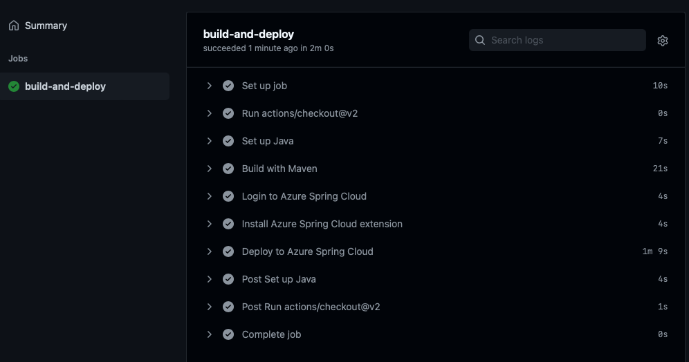

# 11 - Configure CI/CD

__This guide is part of the [Azure Spring Cloud training](../README.md)__

In this section, we will use GitHub Actions to implement continuous deployment to Azure Spring Cloud. For simplicity, we will not implement blue-green deployments in this section, but don't hesitate to come back and add blue-green deployments after completing the remainder of the tutorial.

---

Our microservices and gateway are easy to deploy manually, but it is of course better to automate all those tasks! We are going to use [GitHub actions](https://github.com/features/actions) as a Continuous Integration / Continuous Deployment platform (or CI/CD for short). This configuration is rather simple, so it should be trivial to port it to another CI/CD platform.

We are going to automate the deployment of the `weather-service` microservice that was developed in [07 - Build a Spring Boot microservice using MySQL](../07-build-a-spring-boot-microservice-using-mysql/README.md). It is exactly the same configuration that would need to be done for the `city-service` microservice and the gateway, so if you want to automate them too, you can just copy/paste what is being done in the current guide.

## Configure GitHub

[Create a new GitHub repository](https://github.com/new) and commit the code from the `weather-service` microservice into that repository:

> 🛑 Make sure you substitute the Git URL from your own github repository (make sure you use the HTTPS URL, not the SSH URL). This should be a different repository than the one you used to store configuration in section 4. If a login dialog appears, log in with your regular GitHub credentials.

```bash
cd weather-service
git init
git add .
git commit -m 'Initial commit'
git remote add origin <GIT HTTPS URL HERE>
git push origin master
cd ..
```

You now need to allow access from your GitHub workflow to your Azure Spring Cloud instance. Open up a terminal and type the following command, replacing `$AZ_RESOURCE_GROUP` with the name of your resource group.

🛑 Make sure you assign the name of your resource group to the variable `AZ_RESOURCE_GROUP` or substitute the value for it in the commands below.

```bash
# Prevents a Git bash issue. Not necessary outside of Windows:
export MSYS_NO_PATHCONV=1

# Get the ARM resource ID of the resource group
RESOURCE_ID=$(az group show --name "$AZ_RESOURCE_GROUP" --query id -o tsv)

# Create a service principal with a Contributor role to the resource group.
SPNAME="sp-$(az spring-cloud list --query '[].name' -o tsv)"
az ad sp create-for-rbac --name "${SPNAME}" --role contributor --scopes "$RESOURCE_ID" --sdk-auth
```

This should output a JSON text, that you need to copy.

Then, in your GitHub project, select `Settings > Secrets` and add a new secret called `AZURE_CREDENTIALS`. Paste the JSON text you just copied into that secret.

## Create a GitHub Action

Inside the `weather-service` directory, create a new directory called `.github/workflows` and add a file called `azure-spring-cloud.yml` in it. This file is a GitHub workflow and will use the secret we just configured above to deploy the application to your Azure Spring Cloud instance.

In that file, copy/paste the following content, performing the indicated substitutions:

>🛑 You must substitute the name of your Azure Spring Cloud instance for `<AZ_SPRING_CLOUD_NAME>` and the name of the resource group for `<AZ_RESOURCE_GROUP>` in the YAML below.

```yaml
name: Build and deploy to Azure Spring Cloud

on: [push]

jobs:
  build-and-deploy:
    runs-on: ubuntu-latest
    steps:
    - uses: actions/checkout@v2
    - name: Set up JDK 1.8
      uses: actions/setup-java@v1
      with:
        java-version: 1.8
    - name: Build with Maven
      run: mvn package -DskipTests
    - name: Login to Azure Spring Cloud
      uses: azure/login@v1
      with:
        creds: ${{ secrets.AZURE_CREDENTIALS }}
    - name: Install Azure Spring Cloud extension
      run: az extension add -y --name spring-cloud
    - name: Deploy to Azure Spring Cloud
      run: az spring-cloud app deploy --resource-group <AZ_RESOURCE_GROUP> --service <AZ_SPRING_CLOUD_NAME> --name weather-service --jar-path target/demo-0.0.1-SNAPSHOT.jar
```

This workflow does the following:

- It sets up the JDK
- It compiles and packages the application using Maven
- It authenticates to Azure Spring Cloud using the credentials we just configured
- It adds the Azure Spring Cloud extensions to the Azure CLI (this step should disappear when the service is in final release)
- It deploys the application to your Azure Spring Cloud instance

This workflow is configured to be triggered whenever code is pushed to the repository.
There are many other [events that trigger GitHub actions](https://help.github.com/en/articles/events-that-trigger-workflows). You could, for example, deploy each time a new tag is created on the project.

## Test the GitHub Action

You can now commit and push the `azure-spring-cloud.yml` file we just created.

Going to the `Actions` tab of your  GitHub project, you should see that your project is automatically built and deployed to your Azure Spring Cloud instance:



Congratulations! Each time you `git push` your code, your microservice is now automatically deployed to production.

---

⬅️ Previous guide:  [10 - Blue/Green deployment](../10-blue-green-deployment/README.md)

➡️ Next guide: [12 - Making Microservices Talk To Each Other](../12-making-microservices-talk-to-each-other/README.md)