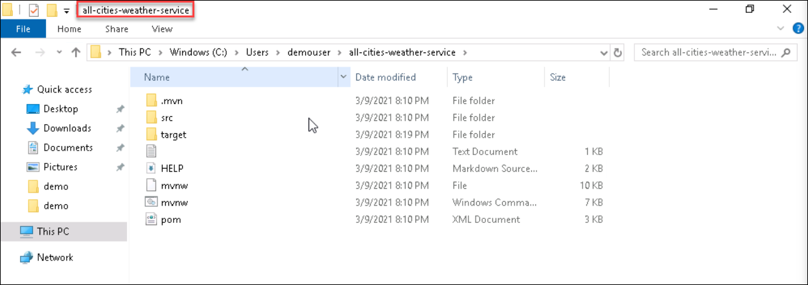
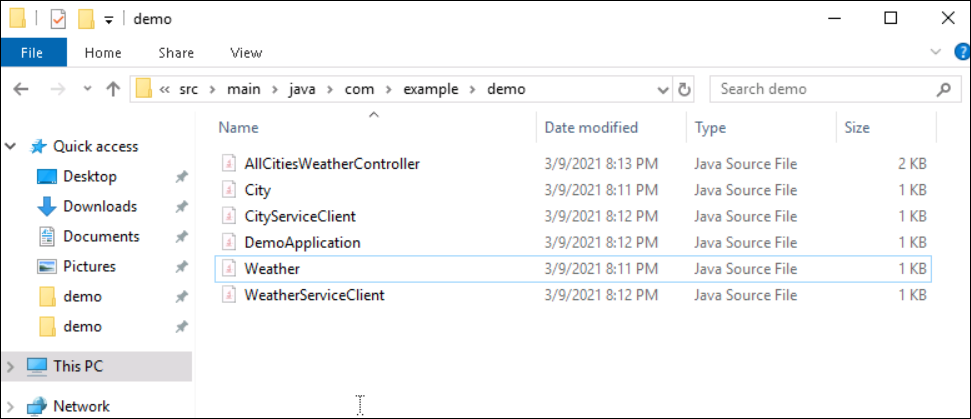
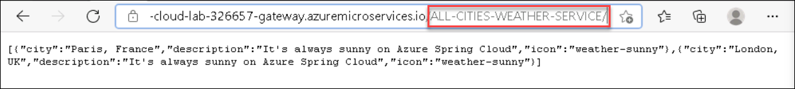

# Exercise 12 - Making Microservices Talk to Each Other

Creating a microservice that talks to other microservices.

---

In Exercise 6 we deployed a microservice that returns a list of cities. In Exercise 7, we deployed a microservice that, given a city, returns the weather for that city. And in Exercise 9, we created a front-end application that queries these two microservices.

There is a glaring inefficiency in this design: the browser first calls `city-service`, waits for it to respond, and upon getting that response, calls `weather-service` for each of the cities returned. All these remote calls are made over public internet, whose speed is never guaranteed.

To resolve this inefficiency, we will create a single microservice that implements the [Transaction Script](https://www.martinfowler.com/eaaCatalog/transactionScript.html) pattern: it will orchestrate the calls to individual microservices and return the weather for all cities. To do this, we will use [Spring Cloud OpenFeign]. OpenFeign will automatically obtain the URLs of invoked microservices from Spring Cloud Registry, allowing us to build our `all-cities-weather-services` microservice without needing to resolve the locations of the constituent microservices.

Note how the code we create in this section is endpoint-agnostic. All we specify is the name of the services we want to invoke in the `@FeignClient` annotation. OpenFeign and Spring Cloud Registry then work together behind the scenes to connect our new microservice to the services we've created previously.

## Task 1 : Create a Spring Boot Microservice

1. To create our microservice, we will invoke the Spring Initalizer service from the command line:

```bash
curl https://start.spring.io/starter.tgz -d dependencies=cloud-feign,web,cloud-eureka,cloud-config-client -d baseDir=all-cities-weather-service -d bootVersion=2.3.8 -d javaVersion=1.8 | tar -xzvf -
```
2. Navigate to the path `C:\Users\demouser\all-cities-weather-service` to find the all-cities-weather-service



## Task 2 : Add Spring code to call other microservices

1. Navigate to the path `C:\Users\demouser\all-cities-weather-service\src\main\java\com\example\demo` next to the `DemoApplication` class, create a `Weather.java` class:

```java
package com.example.demo;

public class Weather {

    private String city;

    private String description;

    private String icon;

    public String getCity() {
        return city;
    }

    public void setCity(String city) {
        this.city = city;
    }

    public String getDescription() {
        return description;
    }

    public void setDescription(String description) {
        this.description = description;
    }

    public String getIcon() {
        return icon;
    }

    public void setIcon(String icon) {
        this.icon = icon;
    }
}
```

Note: this is the same `Weather` class that we created in Exercise 7 when we defined the original `weather-service` with one important difference: we no longer annotate the class as a JPA entity for data retrieval.

2. Next, in the same location create the `City.java` class. This is the same `City` class that we created in exercise 6.

```java
package com.example.demo;

public class City {

    private String name;

    public String getName() {
        return name;
    }

    public void setName(String name) {
        this.name = name;
    }
}
```

3. Then, in the same location, create an interface called `CityServiceClient.java` with the following contents. When we run our new service, OpenFeign will automatically provide an implementation for this interface.

```java
package com.example.demo;

import java.util.List;

import org.springframework.cloud.openfeign.FeignClient;
import org.springframework.web.bind.annotation.GetMapping;

@FeignClient("city-service")
public interface CityServiceClient{

    @GetMapping("/cities")
    List<List<City>> getAllCities();
}

```

4. Create a similar OpenFeign client interface for the weather service, named `WeatherServiceClient.java`.

```java
package com.example.demo;

import com.example.demo.Weather;

import org.springframework.cloud.openfeign.FeignClient;
import org.springframework.web.bind.annotation.GetMapping;
import org.springframework.web.bind.annotation.RequestMapping;
import org.springframework.web.bind.annotation.RequestParam;


@FeignClient("weather-service")
@RequestMapping("/weather")
public interface WeatherServiceClient{

    @GetMapping("/city")
    Weather getWeatherForCity(@RequestParam("name") String cityName);
}

```

5. To enable Spring Cloud to discovery the underlying services and to automatically generate OpenFeign clients, add the annotations @EnableDiscoveryClient and @EnableFeignClients to the `DemoApplication` class (as well as the corresponding `import` statements):

```java
package com.example.demo;

import org.springframework.boot.SpringApplication;
import org.springframework.boot.autoconfigure.SpringBootApplication;
import org.springframework.cloud.client.discovery.EnableDiscoveryClient;
import org.springframework.cloud.openfeign.EnableFeignClients;

@SpringBootApplication
@EnableDiscoveryClient
@EnableFeignClients
public class DemoApplication {
    public static void main(String[] args) {
        SpringApplication.run(DemoApplication.class, args);
    }
}
```

6. Everything is now in place to implement the `all-cities-weather-service`. Create the class `AllCitiesWeatherController.java` as follows:

```java
package com.example.demo;

import java.util.List;
import java.util.stream.Collectors;
import java.util.stream.Stream;

import com.example.demo.City;
import com.example.demo.CityServiceClient;
import com.example.demo.Weather;

import org.springframework.beans.factory.annotation.Autowired;
import org.springframework.web.bind.annotation.GetMapping;
import org.springframework.web.bind.annotation.RestController;

@RestController
public class AllCitiesWeatherController {

    @Autowired
    private CityServiceClient cityServiceClient;

    @Autowired 
    private WeatherServiceClient weatherServiceClient;

    @GetMapping("/")
    public List<Weather> getAllCitiesWeather(){
        Stream<City> allCities = cityServiceClient.getAllCities().stream().flatMap(list -> list.stream());

        //Obtain weather for all cities in parallel
        List<Weather> allCitiesWeather = allCities.parallel()
            .peek(city -> System.out.println("City: >>"+city.getName()+"<<"))
            .map(city -> weatherServiceClient.getWeatherForCity(city.getName()))
            .collect(Collectors.toList());

        return allCitiesWeather;
    }
}
```

7. You should have the following files in the demo folder 
    


## Task 3 : Add time-out settings

1. In order to stop the Feign services timing out automatically, open the `C:\Users\demouser\all-cities-weather-service\src\main\resources\` folder and open `application.properties` file and add:

```properties
feign.client.config.default.connectTimeout=160000000
feign.client.config.default.readTimeout=160000000
```

## Task 4 : Create the application on Azure Spring Cloud

1. As before, create a specific `all-cities-weather-service` application in your Azure Spring Cloud instance:

```bash
az spring-cloud app create -n all-cities-weather-service
```

## Task 5 : Deploy the application

1.You can now build your "all-cities-weather-service" project and send it to Azure Spring Cloud:

```bash
cd all-cities-weather-service
./mvnw clean package -DskipTests
az spring-cloud app deploy -n all-cities-weather-service --jar-path target/demo-0.0.1-SNAPSHOT.jar
cd ..
```

## Task 6 : Test the project in the cloud

1. You can use the gateway created in exercise 8 to access the all-cities-weather-service directly.

>💡__Note:__ the trailing slash (`/`) is not optional.

```bash
https://<Your gateway URL>/ALL-CITIES-WEATHER-SERVICE/
```

2. You should get the JSON output with the weather for all the cities:

```json
[{"city":"Paris, France","description":"It's always sunny on Azure Spring Cloud","icon":"weather-sunny"},
{"city":"London, UK","description":"It's always sunny on Azure Spring Cloud","icon":"weather-sunny"}]
```


---
